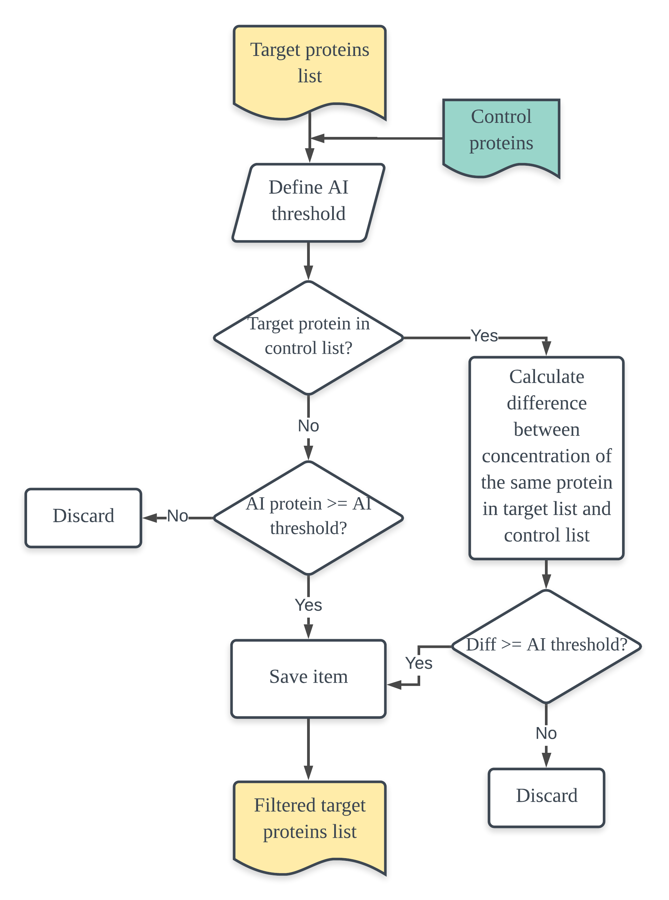

# Protein2gene

***protein2gene*** is a Python-based code designed to perform a mapping of a set of proteinsfrom an plant host, typically obtained by proteomics technics (e.g. AP-MS), to the ortholog gene of a model plant organism.  


# Utility

1. proteinfilter.py

```python proteinfilter.py [samplefilname] [control_filename] [AIcutoff]```

2. protein2gene.py

```python protein2gene.py [protein_filter_out_file]```

3. genefilter.py

```python genefilter.py [genefilter_out_filename] [threshold]```

## About the program...
Simplified workflows of the algorithm implemented in each script:

- Proteinfilter (script I)


- ***protein2gene*** (script II)


- Genefilter (script III)


# Dependencies
- Python 3.x
- Biopython
